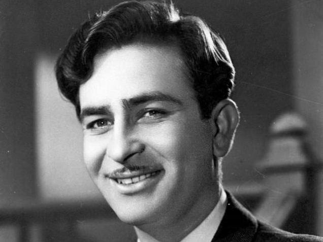
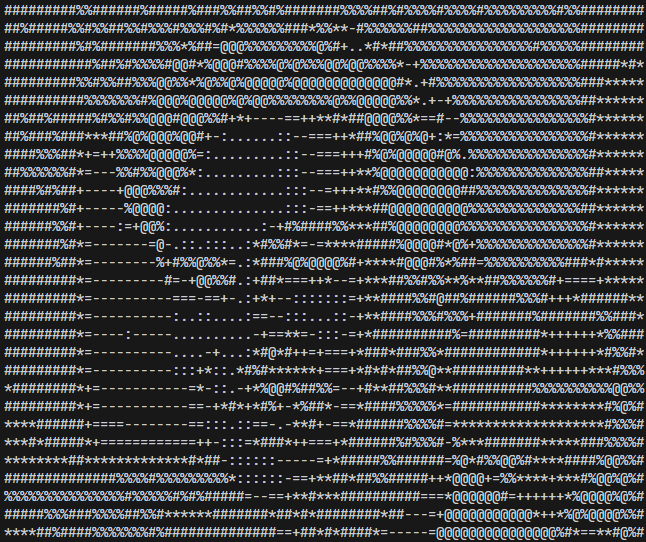

# Raj Kapoor ASCII Art Generator

This project converts a photographic image into ASCII art and then generates a **Python program** that reproduces the ASCII image using only loops and conditional logic.

The pipeline intentionally avoids advanced rendering techniques and focuses on fundamental concepts such as image representation, sampling, ASCII mapping, and code generation.

---

## Project Overview

The project works in three major stages:

1. Convert a standard image (JPG/PNG) into a **P2 PGM grayscale image**
2. Convert the PGM image into a **2D ASCII representation**
3. Generate a **standalone Python script** that prints the ASCII art using `for` loops and `if` statements

The final output is executable Python code that contains the image embedded directly in its control flow.

---

## Directory Structure

```
.
├── ascii_code_generator.py
├── image_to_pgm_conversion.py
├── rajkapoor.jpg
├── rajkapoor.pgm
├── ascii_art_code.py
├── pyproject.toml
├── uv.lock
├── .gitignore
└── .python-version

````

---

## Requirements

- Python **3.12**
- Pillow **>= 12.1.0**

The Python version is enforced via `.python-version`, and dependencies are declared in `pyproject.toml`.

---

## Installation

Create a virtual environment and install dependencies:

```bash
python -m venv .venv
source .venv/bin/activate  # Linux / macOS
# or
.venv\Scripts\activate     # Windows

pip install -r requirements.txt
````

Or, if using `uv`:

```bash
uv sync
```

---

## Step 1: Convert Image to P2 PGM

The script `image_to_pgm_conversion.py` converts a standard image into a **P2-format PGM file**, which is a plain-text grayscale image format.

### Run:

```bash
python image_to_pgm_conversion.py
```

### What it does:

* Loads `rajkapoor.jpg`
* Converts it to grayscale
* Writes a P2 PGM file (`rajkapoor.pgm`)
* Outputs pixel values as ASCII integers

This step ensures the image can be processed without external image libraries in later stages.

---

## Step 2: Generate ASCII Art Code

The script `ascii_code_generator.py` performs the core transformation.

### Run:

```bash
python ascii_code_generator.py
```

### What it does:

1. Reads the P2 PGM image
2. Scales it for terminal-friendly display
3. Samples grayscale pixel values
4. Maps brightness levels to ASCII characters
5. Generates a new Python file (`ascii_art_code.py`)

The generated file contains nested loops and thousands of `if` conditions—one for each character position.

---

## ASCII Character Mapping

Grayscale values are mapped to the following character set:

```
@%#*+=-:. 
```

* Darker pixels map to denser characters
* Brighter pixels map to lighter characters or spaces

This mapping produces visually recognizable ASCII art.

---

## Generated Output

The generated file (`ascii_art_code.py`) is a fully standalone Python program.

### Run it:

```bash
python ascii_art_code.py
```

The ASCII image will be printed directly to the terminal.

No input files or dependencies are required for the generated script.

---

## Showcase

### Original Image vs ASCII Output

Side-by-side comparison of the source image and the generated ASCII art rendered in the terminal.

<div align="center" style="display: flex; align-items: center; justify-content: center; gap: 24px;">

  

  <span style="font-size: 48px; font-weight: bold;">➡</span>

  

</div>

---

### What This Demonstrates

- The original photograph is converted to grayscale and sampled
- Pixel intensities are mapped to ASCII characters
- The final ASCII image is produced by executable Python code
- No image assets are required at runtime for the generated script

Each visible character in the terminal corresponds to a conditional branch in the generated program.

---

### Notes

- Flexbox ensures vertical centering and proper alignment
- Both images are rendered at the same width
- Terminal font and resolution may affect the ASCII appearance

---

## Design Philosophy

This project intentionally prioritizes:

* Simplicity over optimization
* Explicit logic over abstraction
* Educational clarity over performance

The goal is to demonstrate:

* How images are represented numerically
* How ASCII art is constructed
* How programs can generate other programs
* How visual data can be embedded into control flow

---

## Limitations

* Only **P2 PGM** format is supported
* Large images may generate very large output scripts
* Performance is not optimized by design

---

## Use Cases

* Educational demonstrations
* Understanding image processing fundamentals
* Exploring metaprogramming
* ASCII art experiments
* Blog posts or technical write-ups

---

## License

This project is provided for educational and experimental use.
No warranty is implied.